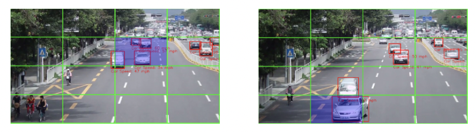
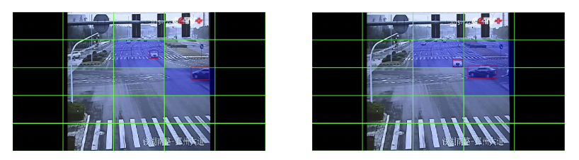
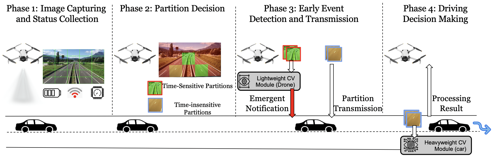

# 🚗 🚡 Griffin

This is the official implementation for our paper titled "_Griffin: Real-time Road Event Detection by Collaborative UAV and Ground Vehicle_" (Paper Under revisions) [[Paper]](https://drive.google.com/file/d/1uCIxh5hbrb4kFi26-uINK4sL9AW1DUMA/view?usp=drive_link)

# ⚡ Description

Ground Vehicles (GVs) achieve micro-level driving decisions by sensing their environments with car-mounted sensors, limiting their ability to efficiently sense and react to road events. The new generation of vehicles, especially special-purpose vehicles, can launch, land, and charge unmanned aerial vehicles (UAVs), offering a more flexible and comprehensive view to guide GVs in real time. However, UAVs have limited computing and energy resources, making them unsuitable for computationally intensive image processing tasks. To address this challenge, we introduce Griffin, a programming and runtime framework enabling real-time, drone-based road event detection by distributing image processing between a collaborative GV and UAV. The key novelty of Griffin lies in partitioning each real-time captured image frame and dynamically deciding where to process each partition based on its criticalness to the event, the real-time status of the drone-car system, and previous processing results. Griffin provides computer vision developers with an intuitive programming interface for calculating the criticalness of each partition and the per-partition processing logic on GV/UAV, along with well-packed computer vision modules fine-tuned for bird’s-eye view road event detection. Additionally, Griffin's runtime features an optimizer that solves the partition distribution problem to minimize UAV energy consumption while meeting application requirements for latency and accuracy. We implemented two applications on Griffin for detecting road events, including collisions, and lane changes. By evaluating these applications' performance on a testbed with a Jetson Tx2 as the drone and an edge server as the GV, we demonstrate that Griffin can achieve a better trade-off between energy efficiency, latency, and accuracy making it a useful tool for developing real-time drone-car collaboration applications.

# 📹 Dataset

We contribute a dataset (GriffinWild) of ~ 500 high-quality videos (x frames) of drone-view road trajectories collected from wild (captured from various sources) for public use. We classify the data into several categories that can be utilized for drone-view research in the future. It can be accessed at [[GriffinWild]](https://drive.google.com/drive/folders/1EPxw5zrwL9lXsRwkYlNfKKs3hxUfigOk?usp=drive_link)

# ⚡ System Approach

# ⚡ Dataset

We contribute a dataset (~500 video streams) of birdview trajectories of ground-vehicles on roads taken from wild. Further, we annotate the vehicles with their speeds estimated using CV algorithms. The dataset can be accessed at  [[Griffin-Dataset]](https://drive.google.com/drive/folders/1OlFtWg9VwWSjqOyTakliqYqBxmtCAIfw?usp=drive_link)

# ⚡ Implementation Modules

The following are the modules that are in development for our proposed system. Their implementations can be found in their respective folders.
1. Speed Detection of Ground Vehicles in Birdview datasets

_We use Yolo-V8 for tracking Ground Vehicles in Birdview trajectory datasets, followed by speed detection of the corresponding vehicles_

2. Speed Detection & Direction Estimation of Drone

_Using Lucas-Kanade optical flow approach, we calculate the speed of drone from the video stream. Direction is estimated using the video stream by utilizing the displacement of the pixels in an ROI (selected by user). The camera view-point is initially calibrated when the user selects the reference origin of the frame. Another parameter pixel_per_meter (ppm) is ingested real-time according to the video stream._

3. Frame partitioning and model offloading

_An offline demonstration of the basic concept of frame partitioning combined with model offloading_

4. Energy consumption estimation for JetsonNano device

_We use [[Jeston Power]](https://github.com/opendr-eu/jetson_power) for measuring the energy consumption of JetsonNanoTx2 that is mounted on-top of drone_

5. Real time commication channel between edge devices and data transfer

_We take part of implemetation from [[Sky-Socket]](https://github.com/JaySchall/Drone-Car-Collaboration) for demonstration of a simple communication channel between JetsonNano and a computer device, followed by partitioning and model offloading (as provided in point 4 above). We plan to implement a robust TCP channel in the near future._ 

6. Training Yolov5 with VisDrone dataset

_We finetune existing Yolov5 checkpoints with data from VisDrone dataset [[VisDrone]](https://github.com/VisDrone/VisDrone-Dataset). We perform this to improve Ground Vehicle(specifically Car) detections on roads in birdview real scenes. The code and checkpoints would be released shortly._ 
